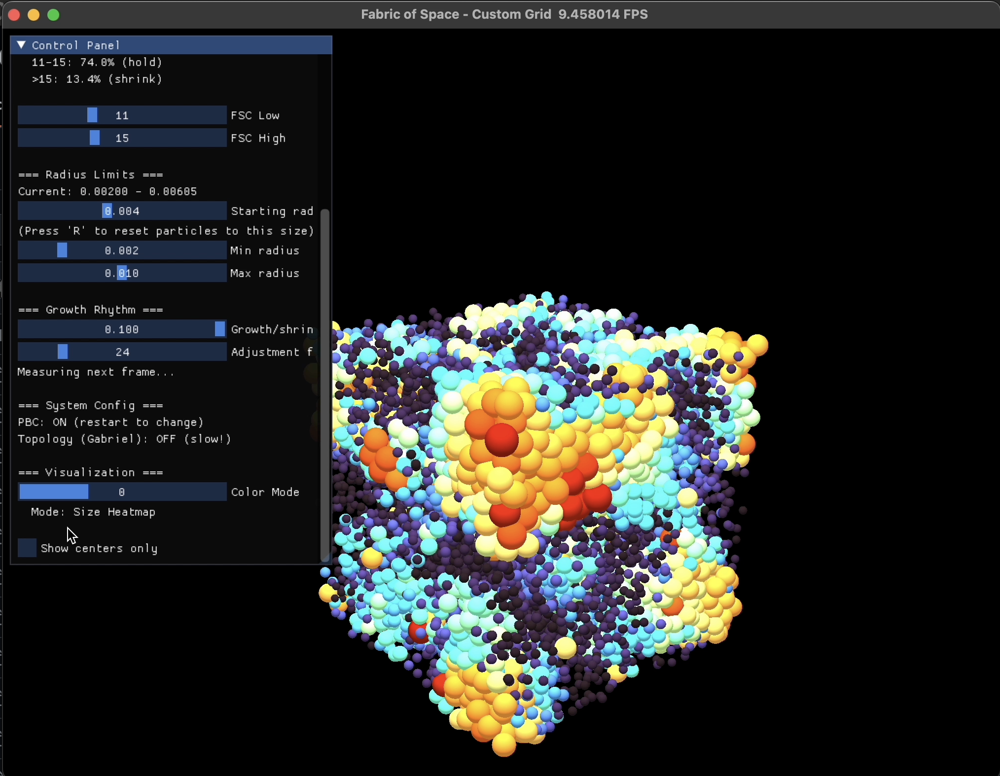

# Fabric of Space - Topological Foam Simulator

> **"Topology-driven foam: cells grow/shrink by neighbor count (FSC), pressure flows through shared faces—no forces, pure structure-to-mechanics control."**



*Real-time topological foam simulation with 10,000 particles showing size-based heatmap coloring and live FSC control panel.*

A real-time GPU-accelerated foam simulation implementing **dual-channel topological control**: Face-Sharing Count (FSC) from power diagrams drives structural adaptation, while volume-conserving pressure equilibration ensures mechanical consistency. Interactive, GPU-optimized, and running at ~4 FPS on 10,000 particles.


-brightgreen.svg)

---

## 📝 **What Is This?**

### **Short Description**

**Fabric of Space: Topological Foam Simulator**  
Real-time cellular structure evolution driven by **Face-Sharing Count (FSC)** from a power diagram. Cells adapt radii to maintain target connectivity; volume-conserving pressure diffusion creates mechanical equilibrium. PBD enforces constraints, Minkowski spheres visualize pressure. GPU-accelerated (~4 FPS, 10k particles), interactive via live FSC band sliders. **No SPH, no DEM forces—pure control theory.**

### **Technical Description**

A dual-channel topological foam simulator implementing control-theoretic cellular adaptation:

**Channel 1: FSC Controller (Structural)**  
Jump Flood Algorithm (JFA) computes a 3D power diagram (weighted Voronoi tessellation) to extract Face-Sharing Counts—the number of topological neighbors per cell. Cells adjust radii via adaptive EMA to maintain a target FSC band, driving long-term structural evolution with hysteresis to prevent oscillation.

**Channel 2: Pressure Equilibrator (Mechanical)**  
Volume-conserving pressure diffusion across FSC neighbors using Jacobi iteration. Each frame, volume flows between topologically connected cells (∆V ∝ P_i - P_j) until local mechanical equilibrium. No explicit forces; pressure gradients emerge from volume imbalance.

**Supporting Systems:**  
- Position-Based Dynamics (PBD): Enforces non-penetration constraints  
- Brownian motion: Thermal agitation prevents frozen equilibrium  
- Periodic boundary conditions (PBC): Unbounded domain simulation  
- Minkowski sphere rendering: Visualizes pressure fields, not geometric surfaces  

**Performance:**  
Multi-rate JFA decimation (1/5 cadence after warm-start), adaptive resolution, and early-exit passes achieve ~4 FPS on 10k particles (~3.5× speedup from baseline). Warm-start topology stabilization and watchdog drift detection ensure correctness.

**Key Distinction:** Neither SPH (no Navier-Stokes PDEs) nor classical DEM (no Hertzian contact forces). Instead, a **control-theoretic** approach where topology defines structure and volume flux defines dynamics. Suitable for studying emergent foam behavior, cellular packing, and topological phase transitions.

### **One-Liner for Papers/Citations**

*"A control-theoretic cellular simulator where topological properties (Face-Sharing Count from power diagrams) govern structural adaptation, and volume-conserving pressure diffusion enforces mechanical equilibrium—without explicit forces or fluid PDEs. The approach bridges computational geometry (JFA-based topology detection) and dynamical systems (dual-channel feedback control)."*

## 🌟 Features

### Core Simulation
- **FSC-Only Control**: Radius adaptation driven solely by Face-Sharing Count (FSC) from power diagrams
- **Pressure Equilibration**: Volume-conserving pressure diffusion across topologically connected neighbors
- **Hysteresis + EMA Lag**: Advanced controller preventing "frozen equilibrium" deadband lock
- **Continuous Dynamics**: Foam remains dynamically active even at equilibrium through micro-nudging
- **Periodic Boundary Conditions**: Seamless wrapping for infinite-domain behavior

### Technical Implementation
- **Jump Flood Algorithm (JFA)**: Efficient GPU-accelerated power diagram computation on voxel grids
- **Position-Based Dynamics (PBD)**: Robust overlap resolution with adaptive iteration count
- **Adaptive EMA Smoothing**: Gradual radius changes with per-frame caps and backpressure
- **Brownian Motion**: Thermal jitter to maintain continuous "breathing" behavior
- **Warm-start Mechanism**: Prevents FSC=0 runaway during startup

### Visualization & Control
- **Live GUI Sliders**: Real-time adjustment of FSC band, growth rate, and timing parameters
- **Heatmap Coloring**: Radius-based color coding (red=large, cyan=small, yellow=mid-range)
- **Freeze-Frame Validator**: Diagnostic tool for PBC and grid integrity
- **Comprehensive Telemetry**: FSC stats, distribution, pressure metrics, and performance monitoring

---

## 🚀 Quick Start

### Prerequisites
- Python 3.9 or higher
- GPU with Vulkan/CUDA/Metal support (recommended for performance)

### Installation

```bash
# Clone the repository
git clone https://github.com/VirtualOrganics/Fabric-of-Space-Taichi-JFA.git
cd Fabric-of-Space-Taichi-JFA

# Create virtual environment
python -m venv venv
source venv/bin/activate  # On Windows: venv\Scripts\activate

# Install dependencies
pip install -r requirements.txt
```

### Running the Simulation

```bash
python run.py
```

The simulation window will open showing 10,000 particles in a periodic 3D domain.

---

## 🎮 Controls

### Keyboard
- **Space**: Pause/Resume simulation
- **R**: Reset particles to random positions
- **F**: Freeze-frame diagnostic test (validates PBC & grid integrity)
- **Q** or **Escape**: Quit simulation

### GUI Sliders
- **FSC Low/High**: Set the target topological connectivity band
  - Particles below `FSC_LOW` grow
  - Particles above `FSC_HIGH` shrink
  - Particles in-band receive micro-nudges toward band center
- **Growth/Shrink Rate**: Adjust size change percentage per cycle
- **Starting Radius**: Set initial particle size for resets
- **Min/Max Radius**: Clamp particle size range

---

## 📊 Understanding the Output

### Telemetry (Console)
```
[JFA Measurement] frame=320
  FSC: μ=12.2 [8,18] | band=[11,12]
  Distribution: grow=645 (6.5%) | in-band=5699 (57.0%) | shrink=3656 (36.6%)
  r_mean: 0.003843 → target=0.003768
  Settling for 15 frames...
[EQ Debug] max|Δr|=0.00005985 | changed=9139/10000
[Pressure] r_min=0.004088 r_max=0.004760 σ(P)=0.000000
```

**Interpretation:**
- **FSC μ=12.2**: Mean Face-Sharing Count across all particles
- **band=[11,12]**: Target FSC range (narrow band = tight topological control)
- **Distribution**: Percentage of particles growing/holding/shrinking
- **r_mean → target**: Current mean radius and target after controller action
- **max|Δr|**: Maximum radius change from pressure equilibration
- **changed**: Number of particles adjusted by pressure equilibrator

### Visual Heatmap
- **Red/Orange**: Large particles (high pressure, shrinking)
- **Cyan/Blue**: Small particles (low pressure, growing)
- **Yellow/Green**: Mid-range particles (near equilibrium, micro-nudging)

---

## 🔬 Technical Details

### Architecture

The simulator consists of two complementary control channels:

1. **FSC Controller (Slow/Global)**
   - Drives system toward target topological connectivity
   - Uses hysteresis and EMA-lagged FSC for decisions
   - Prevents deadband lock with continuous micro-nudges
   - Updates: Every measurement frame (~15-30 frames)

2. **Pressure Equilibrator (Fast/Local)**
   - Balances pressure across FSC-connected neighbors
   - Volume-conserving Jacobi iteration
   - Creates mechanical consistency
   - Updates: Every frame

### Key Algorithms

#### Jump Flood Algorithm (JFA)
Computes power diagrams (weighted Voronoi tessellations) on a 192³ voxel grid:
1. Initialize grid with particle IDs and weights
2. Parallel flood passes (stride halving: 64, 32, 16, ...)
3. Face detection via Minkowski bisector witness tests
4. FSC extraction from detected faces

#### Hysteresis + EMA Lag Controller
Prevents frozen equilibrium through:
- **EMA decisions**: Use smoothed FSC (temporal lag) instead of raw FSC
- **Hysteresis gap**: ±1 FSC buffer zones for smooth transitions
- **Idle micro-nudge**: 0.3% drift toward band center when in-band

#### Pressure Equilibration
Volume-conserving diffusion across shared faces:
```
ΔV_ij = κ (V_i - V_j)  [capped per-pair]
V_i' = V_i - ΔV_ij
V_j' = V_j + ΔV_ij
r' = V'^(1/3)
```

---

## ⚙️ Configuration

Key parameters in `config.py`:

### Simulation
```python
MAX_N = 50000              # Maximum particle capacity
DOMAIN_SIZE = 0.189        # Periodic cube side length
R_START_MANUAL = 0.004     # Initial radius
R_MIN = 0.002              # Minimum radius clamp
R_MAX = 0.010              # Maximum radius clamp
```

### FSC Controller
```python
FSC_LOW = 8                # FSC lower bound (grow below)
FSC_HIGH = 20              # FSC upper bound (shrink above)
GROWTH_PCT = 0.10          # 10% per measurement cycle
ADJUSTMENT_FRAMES = 15     # Frames to ~95% convergence
```

### Pressure Equilibration
```python
PRESSURE_EQUILIBRATION_ENABLED = True
PRESSURE_K = 0.10          # Diffusion coefficient
PRESSURE_EXP = 3.0         # Volume exponent (3 for 3D)
PRESSURE_PAIR_CAP = 0.02   # Per-pair ΔV cap (fraction)
MAX_EQ_NEI = 10            # Max neighbors per frame
```

### Brownian Motion
```python
BROWNIAN_ENABLED = True
BROWNIAN_STRENGTH = 0.0002 # Velocity noise strength
BROWNIAN_DAMPING = 0.95    # Velocity damping (5% friction)
```

---

## 🧪 Testing & Validation

### Freeze-Frame Test (Press F)
Validates:
- ✅ CSR grid integrity (every particle assigned to exactly one cell)
- ✅ PBC correctness (all particles within primary cell)
- ✅ No spatial hash collisions

### Expected Behavior
- **Narrow band** (e.g., [11,12]): Active dynamics, most particles shrinking
- **Wide band** (e.g., [8,20]): Gentle dynamics, most particles in-band
- **Slider response**: Changes take effect within 1-2 measurement cycles
- **Continuous motion**: System never fully freezes, even at equilibrium

---

## 📁 Project Structure

```
Fabric-of-Space-Taichi-JFA/
├── run.py              # Main simulation loop, GUI, telemetry
├── config.py           # Global constants and parameters
├── dynamics.py         # Controllers, PBD, pressure equilibration
├── grid.py             # CSR spatial hashing, PBC helpers
├── jfa.py              # Jump Flood Algorithm, power diagrams
├── topology.py         # Topological utilities (legacy)
├── requirements.txt    # Python dependencies
├── tests/
│   └── test_jfa.py    # JFA unit tests
└── docs/              # Additional documentation (blueprints)
```

---

## 🎯 Design Philosophy

### Why FSC-Only?
Geometric degree (distance-based neighbor counting) is unreliable and drifts with tolerance, timing, and packing noise. FSC (Face-Sharing Count from power diagrams) is a **topological** metric that directly measures cell connectivity, making it stable, scale-invariant, and physically meaningful.

### Wet vs. Dry Foam
- **Visual "wet" spheres**: Minkowski spheres with gaps (for rendering)
- **Underlying "dry" mesh**: Power diagram where faces imply contact
- **Pressure equilibration**: Bridges the two, ensuring visual consistency with topological constraints

### Two-Channel Control
- **FSC controller**: Sets long-term topological structure (target FSC band)
- **Pressure equilibrator**: Ensures local mechanical consistency (pressure balance)
- **Independence**: They run at different cadences and operate on different metrics

---

## 🐛 Known Issues & Limitations

### JFA Asymmetry
- **Issue**: JFA validation reports high asymmetry percentage (180-220%)
- **Impact**: Known artifact of voxelized face detection; does not affect stability
- **Status**: Validation check relaxed (warning only)

### Resolution Scaling
- **Issue**: Very small or very large particle counts may require JFA resolution tuning
- **Workaround**: Adjust `JFA_RES_MIN` and `JFA_RES_MAX` in `config.py`

---

## ✅ Recently Fixed

### σ(P) Telemetry (fp32 Underflow) - **FIXED**
- **Was**: Pressure variance (`σ(P)`) reported `0.000000` due to GPU fp64 limitations
- **Fix**: Moved variance computation to CPU-side using NumPy with fp64 accumulators (Welford's algorithm)
- **Now**: `σ(P)` displays correctly in scientific notation (e.g., `σ(P)=2.12e-08`)
- **Commit**: [b8943af](https://github.com/VirtualOrganics/Fabric-of-Space-Taichi-JFA/commit/b8943af) (Oct 30, 2025)

---

## ⚡ Performance & Optimization

### Current Performance
- **~4.2 FPS** @ 10,000 particles @ 270³ JFA resolution (M1 Pro / similar GPU)
- **JFA = 70-75%** of frame time (topology detection bottleneck)
- **Multi-rate decimation** (JFA every 5 frames) → **2.4× speedup** ✅
- **Adaptive resolution** (scales with mean radius) → **1.3× speedup** ✅
- **Early-exit JFA** (stops at ~8/10 passes) → **~15% JFA time reduction** ✅

**Cumulative Speedup:** ~3.5× from baseline (1.2 FPS → 4.2 FPS)

### Optimization Status

See **[`docs/GITHUB_ISSUES.md`](docs/GITHUB_ISSUES.md)** for detailed optimization analysis:

1. **Multi-Rate Loop (JFA Decimation)** ✅ *Complete*  
   Run JFA at 1/5 cadence with warm-start + watchdog → 2.4× speedup

2. **Adaptive JFA Resolution** ✅ *Complete*  
   Scale voxel grid with mean radius dynamically (`res ∝ L / r_mean`) → 1.3× speedup

3. **Early-Exit JFA Passes** ✅ *Complete*  
   Stop flood iterations when voxel changes drop below 0.6% → 8/10 passes typical (~15% JFA speedup)

4. **Temporal Skip (Activity-Based JFA Scheduling)** ❌ *Not Applicable*  
   Blocked by continuous activity (Brownian + Pressure EQ) → No cycles skipped

5. **Dirty Tiles (Spatial Decimation)** ❌ *Not Applicable*  
   Blocked by global motion (100% dirty tiles every cycle) → No spatial savings

### Why Optimization Has Plateaued

The system is **activity-bound**, not **compute-bound**:
- Brownian motion → all particles move every frame
- Pressure equilibration → radii change every frame
- JFA must respond to these changes → no safe way to skip work

**To achieve >2× additional speedup would require:**
- Disabling continuous motion (defeats "alive foam" goal)
- Reducing particle count (defeats visual richness)
- Accepting lower topology accuracy (defeats FSC control)
- **Using a different algorithm** (e.g., pure SPH, GPU-native kernels)

**Current performance is reasonable** for this class of simulation (real-time topological foam with 10k particles).

> **Note:** Performance metrics are logged every 60 frames via `[PERF]` telemetry in the console.

---

## 🤝 Contributing

Contributions are welcome! Please feel free to submit issues or pull requests.

### Development Setup
```bash
# Install development dependencies
pip install -r requirements.txt

# Run tests
python -m pytest tests/
```

---

## 📚 References

1. **Lévy et al.** - "Large-scale semi-discrete optimal transport" (2024)  
   arXiv:2406.04192 - Inspiration for pressure diffusion across dual graph

2. **Rong, Bao, Chen** - "Taichi: A Language for High-Performance Computation on Spatially Sparse Data Structures" (2019)  
   ACM SIGGRAPH Asia

3. **Jump Flood Algorithm** - Efficient parallel Voronoi diagram computation on GPUs

---

## 📄 License

This project is licensed under the MIT License - see the LICENSE file for details.

---

## 🙏 Acknowledgments

- **Taichi Team**: For the amazing GPU-accelerated compute framework
- **Virtual Organics**: Research and development
- Special thanks to the AI assistants who helped debug and optimize this codebase

---

## 📞 Contact

For questions, suggestions, or collaborations:
- GitHub: [VirtualOrganics](https://github.com/VirtualOrganics)
- Repository: [Fabric-of-Space-Taichi-JFA](https://github.com/VirtualOrganics/Fabric-of-Space-Taichi-JFA)

---

**Built with ❤️ using Taichi**
